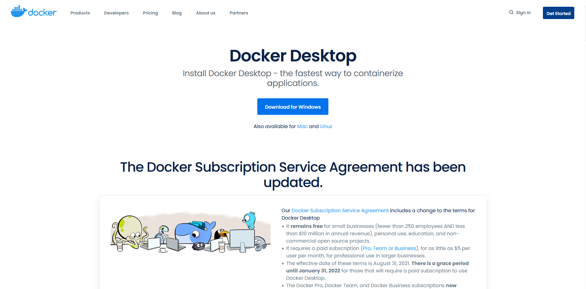
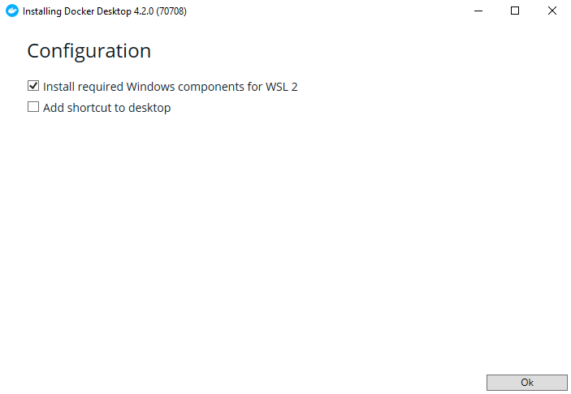
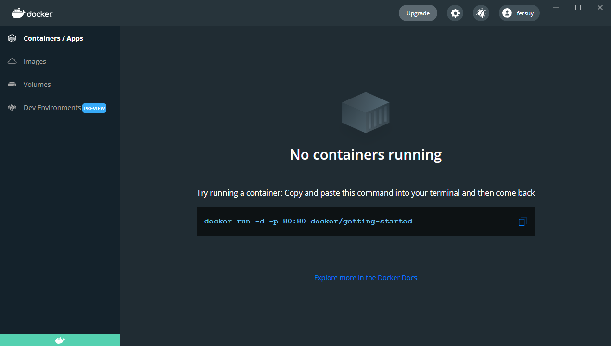

Windows Get started
=====
Docker isn't native on Windows, here we will show how to run Docker on Windows.

Requirements
------------
PowerShell
^^^^^^^^^^^^^^
First of all, install the **PowerShell**. The PowerShell is a new cross-platforme shell develope by Windows. Install it from:

* `Official documentation <https://docs.microsoft.com/en-us/powershell/scripting/install/installing-powershell-on-windows?view=powershell-7.2>`_  
  
  or
* Microsoft Store

Docker Desktop
^^^^^^^^^^^^^^
To use Docker on windows, install `Docker Desktop <https://www.docker.com/products/docker-desktop>`_:

   Download **Docker Desktop** installer

Execute the installer and accept "**install required Windows components for WSL**"" when it will be ask:

   Docker Desktop installer

.. note::
   Windows Subsystem for Linus (WLS) run a GNU/Linux environment on Windows (`More information ? <https://docs.microsoft.com/en-us/windows/wsl/about>`_ )

WSL
^^^^^^^^^^^^^^^
Depending on your system, Docker Desktop will ask to install/update WSL.
In some cases the following command is enough otherwise following this `documentation <https://docs.microsoft.com/en-us/windows/wsl/install-manual>`_.

.. code-block:: powershell

   # Restart computer after
   wsl --install 

Running Docker
----------------
At this point, docker image should be runnable on the computer

Docker CLI basics
^^^^^^^^^^^^^^^^^^^^^^^
The main commands for using docker:

.. code-block:: bash

   docker ps # Print the running conteiner
   docker images # Print the image present on your laptop
   docker run <image> # Run a image (start conteiner)
   docker stop <conteiner_id_or_name> # Stop a conteiner
   docker rm <conteiner_id_or_name> # remove a conteiner

Test environment
^^^^^^^^^^^^^^^^
First, "**ENGINE RUNNING**"" should appear when your mousse passe over the Docker logo down left of the Docker Desktop application. If docker engine doesn't running, it's probably a problem with wsl.

   Docker Desktop

*Docker Engine* are running, let's try the command above. 

.. code-block:: bash

   docker run -d -p 80:80 docker/getting-started

The *docker run* command start conteiner. 

*  *-d* option permit to **D**etach the process of your shell (backrund running the conteiner). 
*  *-p 80:80* bind the port 80 of ther conteiner on the port 80 of your laptop (usefull to run web server). 
*  *docker/getting-started* is the name of the image which will be runing. Docker will search it on your laptop or download it if not present.

That's works, let's remove the conteiner:

.. code-block:: bash

   # Copy ID or name
   docker ps
   # Delete the conteiner
   docker rm <conteiner_id_or_name>

PIE image
^^^^^^^^^

Finaly, how well run the EPITA PIE image ? 
First create a folder on your laptop: (exemple with PowerShell)

.. code-block:: bash

   mkdir ${HOME}/my_awersome_project

Now, the command to run PIE image:

.. code-block:: bash

   docker run -it --name docker-pie --rm -w /root/home -e HOME=/root/home -v ${HOME}\my_awersome_project:/root/home registry.cri.epita.fr/cri/infrastructure/nixpie/nixos-pie:latest sh

Let's understand it:

*  **docker run**, you already know
*  **-it**, interactive mode (permit to have interaction with the image)
*  **--name**, name for the conteiner, here *docker-pie*
*  **--rm**, auto-remove the conteiner when we close it
*  **-w**, set working directory inside the conteiner, here */root/home*
*  **-e**, set environement variable inside the conteiner, here $HOME="/root/home"
*  **-v**, bind a directory of your laptop to one on the conteiner (a kind of volume), here we bind the previously created directory on "*/home/root*"
*  **registry.cri.epita.fr/cri/infrastructure/nixpie/nixos-pie:latest**, the latest version of the PIE image
*  **sh**, programme to run interactively

The image is heavy, it took time to download it. Don't worry we only download once,  when a new version are available.
After a few moments of downloading, your conteiner should be running, congratulation !

VsCode x Docker
---------------
--> Soon